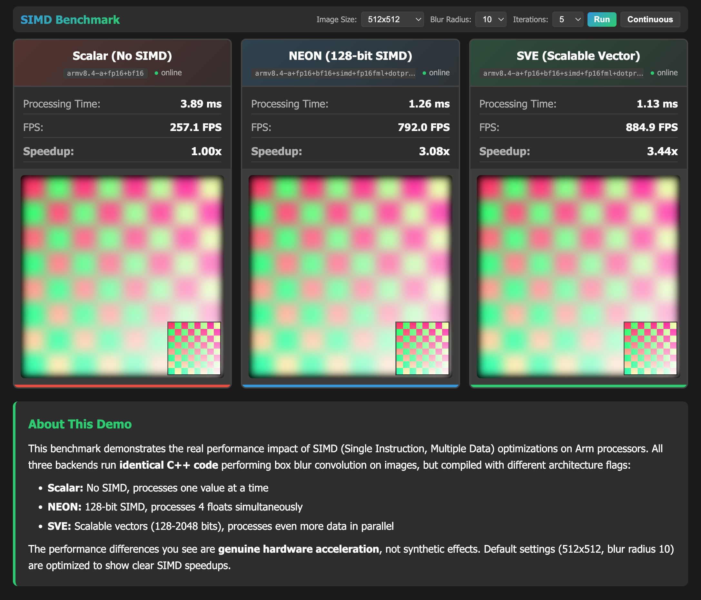

# SIMD Visual Benchmark

> This is a [Topo](https://github.com/arm/topo) Project and follows the [Topo Project Specification](https://github.com/arm/topo/tree/main/docs/project-specification).

Visual demonstration of SIMD performance benefits on Arm processors. Compare scalar (no SIMD), NEON (128-bit), and SVE (scalable vector) implementations running identical image processing workloads side-by-side.

It demonstrates:

- Use of multi-stage docker builds with Topo
- Running and profiling hardware acceleration features with a simple image box blur algorithm
- An interactive web dashboard to run and view the benchmark results

To find out more about the project format, see the [Topo Project Specification](https://github.com/arm/topo/tree/main/docs/project-specification).

## Usage

To use this project download and install `topo` from [arm/topo](https://github.com/arm/topo)

### Clone the project:

```bash
topo clone git@github.com:Arm-Examples/topo-simd-visual-benchmark.git
```

The clone step will prompt you for values for the project parameters.

### Build and Deploy the project:

```bash
cd topo-simd-visual-benchmark
topo deploy --target <ip-address-of-target>
```

### What you will see

Once deployment completes, open a browser to `http://<ip-address-of-target>:8095`, click "Run" in the top right and you'll



# Acknowledgments

This project makes use of Arm's [simd-loops](https://gitlab.arm.com/architecture/simd-loops) project to perform the hardware-accelerated convolution.
